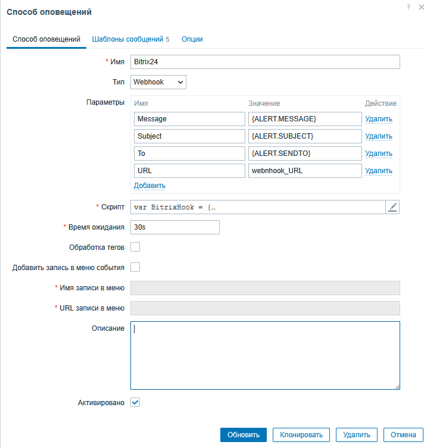

# Как послать сообщение из Zabbix в Битрикс24
## 1. Настройка Битрикс 24
### 1.1 Создать пользователя
<https://dev.1c-bitrix.ru/user_help/settings/users/user_edit.php?ysclid=mn4q9swhst457229356>
### 1.2 Создание веб хука
<https://helpdesk.bitrix24.ru/open/20886106/?ysclid=mn4q2kr8y8671352686>
### 1.3 Создание чата
<https://helpdesk.bitrix24.ru/open/25440238/?ysclid=mn4q5j7y5x481667462>
## 2. Настройка Zabbix
### 2.1 Настройка способа оповещения
Добавить способ оповещения, заменив webhook_URL на свой веб хук.
В раздел Скрипт добавить

```java
var BitrixHook = {
    webhook: null,
    to: null,
    message: null,


    sendMessage: function () {
        var params = {
            DIALOG_ID: BitrixHook.to,
            MESSAGE: BitrixHook.message,
        },
        data,
        response,
        request = new HttpRequest(),
        url = BitrixHook.webhook + '/im.message.add.json';

        request.addHeader('Content-Type: application/json');
        data = JSON.stringify(params);
        Zabbix.log(4, '[BitrixHook Webhook] URL: ' + url);
        Zabbix.log(4, '[BitrixHook Webhook] params: ' + data);
        response = request.post(url, data);
        Zabbix.log(4, '[BitrixHook Webhook] HTTP code: ' + request.getStatus());

        try {
            response = JSON.parse(response);
        }
        catch (error) {
            response = null;
        }

        if (request.getStatus() !== 200)  {
            if (typeof response.error_description === 'string') {
                throw response.error_description;
            }
            else {
                throw 'Unknown error';
            }
        }
    }
};

try {
    var params = JSON.parse(value);

    BitrixHook.to = params.To;
    BitrixHook.message = params.Subject + '\n' + params.Message;
    BitrixHook.webhook = params.URL

    BitrixHook.sendMessage();

    return 'OK';
}
catch (error) {
    Zabbix.log(4, '[BitrixHook Webhook] notification failed: ' + error);
    throw 'Sending failed: ' + error + '.';
}
```


